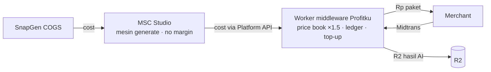

# Profitku Cloud Console — desain middleware (repo baru `profitku-cloud`)

> Desain kontrak untuk repo baru. Repo kasirgratisan tetap: POS offline + sync +
> backup + subscription (`api.profitku.my.id`). Repo ini: console cloud
> (admin/ai/report/sales) + worker middleware (credit, top-up, proxy AI, report,
> sales). Keputusan terkunci di `docs/DECISIONS.md` (2026-08-06).

## 1. Tujuan & lingkup

- Admin Profitku (`dashboard.profitku.my.id`) pindah dari `admin/` → repo ini,
  plus fitur baru **kelola top-up/riwayat/refund credit merchant**.
- `ai.profitku.my.id`: merchant (langganan cloud) generate foto/video AI —
  bayar **credit** terpisah dari langganan 25rb/bulan.
- `report.profitku.my.id`: merchant lihat seluruh laporan dari perangkat mana pun
  (data dari `sync_records`).
- `sales.profitku.my.id`: role sales (katalog share WA + sales order ke WA admin
  kantor; WA-only dulu).
- **Bukan lingkup:** mengubah mesin POS, mengganti model langganan 25rb, atau
  men-scaffold integrasi SnapGen (itu milik MSC Studio).

## 2. Rantai nilai & pricing (Opsi C)



- **MSC Studio = cost-only.** Melaporkan biaya aktual; tidak menghitung margin.
- **Profitku = satu-satunya pemilik margin.** Rumus:
  `charge_credits = roundUp(snapgen_cost × SNAPGEN_CREDIT_RP / 100 × 1.5)`
  dengan asumsi awal `SNAPGEN_CREDIT_RP = 100` (1 credit = Rp 100).
  Contoh `low/2K = 7` → `11 credit = Rp 1.100` (COGS Rp 700 → margin Rp 400).
- Sumber harga: **matrix terukur MSC** (bukan docs SnapGen — docs tidak akurat).
- Harga dibekukan saat job dibuat; ditampilkan dalam **Rp** sebelum submit.

## 3. Struktur monorepo

```
profitku-cloud/
  apps/
    admin/    # dipindah dari kasirgratisan/admin → dashboard.profitku.my.id
    ai/       # → ai.profitku.my.id
    report/   # → report.profitku.my.id
    sales/    # → sales.profitku.my.id
  api/        # Worker Hono (middleware): credit, top-up, ai-proxy, report, sales
  packages/shared/  # types, i18n, UI kit
  supabase/   # migrasi credit + report RPC (namespace terpisah)
  docs/
```

Deploy: Cloudflare Pages ×4 (SPA) + 1 Worker (middleware). Worker middleware
**terpisah** dari `api.profitku.my.id` (POS). Secret (MSC token, Midtrans) hanya
di worker middleware.

## 4. Kontrak integrasi MSC Studio (cost-only)

| Endpoint MSC | Pemakaian middleware |
|---|---|
| `GET /api/v1/pricing` | Ambil biaya snapgen per model/mode/resolusi (cost saja) |
| `POST /api/v1/generate` | Submit job (idempotency key); return job id + cost |
| `GET /api/v1/jobs/:id` | Polling status |
| webhook (signature) | Notifikasi selesai/gagal → middleware simpan R2 + debit/refund |

Aturan: debit merchant **hanya saat sukses**; refund/reserve-release saat gagal;
hold/reserve sebelum submit; batas job konkuren & harian per user; hasil media
diunduh ke **R2 Profitku** (jangan andalkan URL snapgen — ada TTL).

## 5. Ledger credit (Supabase)

- `credit_accounts` — saldo per user/store; saldo tidak negatif.
- `credit_transactions` — `topup | usage | refund | adjust` + idempotency key.
- `credit_packages` — paket Rupiah (25k=250, 50k=510, 100k=1.050).
- `ai_jobs` — status, cost (COGS), charge (×1.5), uuid, hasil (R2 url).

Alur top-up: merchant pilih paket → Midtrans checkout → webhook (idempotent) →
credit masuk → admin bisa lihat riwayat / refund / adjust.

## 6. Laporan merchant (`report.profitku.my.id`)

- Sumber: `sync_records` (sudah ada dari pipeline sync POS).
- RPC agregasi: penjualan harian/per produk/per kategori/per kasir, hutang, stok,
  shift. RLS **merchant-scoped** (hanya data toko milik user).
- UI jujur: tampilkan "data per [last sync]" (bukan klaim realtime streaming).

## 7. Sales (`sales.profitku.my.id`, WA-only)

- Katalog produk dari sync cloud → **share via WhatsApp** (wa.me + ringkasan +
  gambar).
- Sales order per customer → kirim ke **WA admin kantor** via Fonnte.
- (Fase berikut) pending-order masuk POS = ubah schema transaksi + sync — ditunda.

## 8. Urutan implementasi

| Fase | Isi | Keluar |
|---|---|---|
| P0 | MSC → cost-only; scaffold monorepo + pindah admin + worker skeleton | Fondasi |
| P1 | Credit ledger + top-up Midtrans + UI admin kelola saldo | Merchant bisa beli credit |
| P2 | ai.profitku (proxy MSC, hold/debit/refund, R2, notifikasi) | AI end-to-end |
| P3 | report.profitku (RPC dari sync_records + RLS) | Laporan merchant |
| P4 | sales.profitku (katalog WA + sales order Fonnte) | Sales lapangan |

## 9. Risiko & mitigasi

| Risiko | Mitigasi |
|---|---|
| COGS AI tak terkendali | hold credit, batas harian/konkuren, refund on fail |
| Accounting salah (uang prepaid) | idempotensi webhook, saldo non-negatif, audit, tes ketat |
| SnapGen docs tidak akurat | pakai matrix terukur MSC |
| URL media snapgen TTL | unduh ke R2 Profitku |
| Migrasi Supabase bentrok | namespace migrasi terpisah dari repo kasirgratisan |
| Overpromise "real-time" | tampilkan timestamp last sync |
